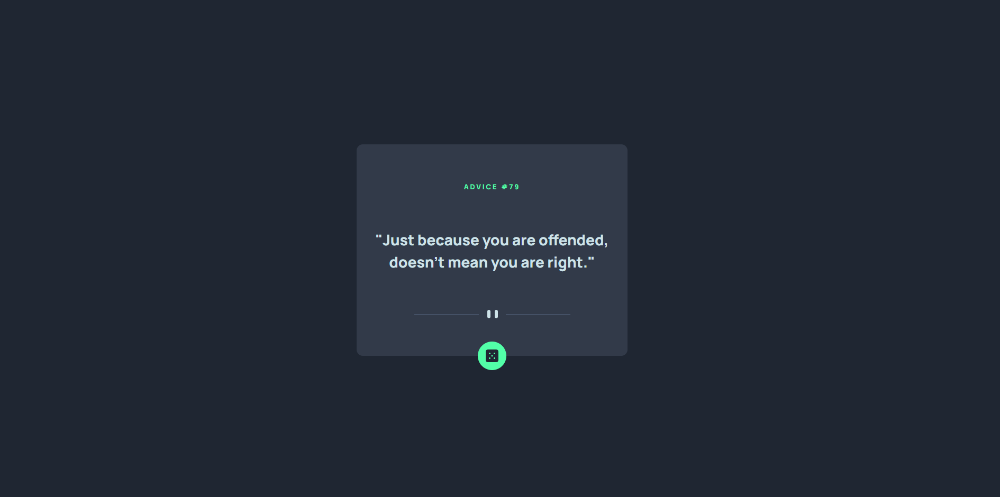

# Frontend Mentor - Advice Generator App

### Screenshot

### Links

- Live Site URL: [https://advice-generator-10.vercel.app/]

### Built with

- React

### What I Learned

- What are promises
- How to fetch data from a url
- Error handling while fetching data
- What is cache: {"no-cache"} inside fetch

## Author

- Frontend Mentor - [@krutagna10](https://www.frontendmentor.io/profile/krutagna10)
